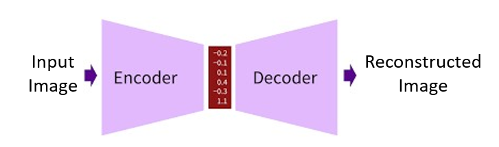

## Table of Content
- [Overview](#overview)
- [Algorithm](#algorithm)
- [How to Use](#how-to-use)
- [Demo](#demo)
- [Reference](#reference)

## Overview
The application is an example on how to use the image compression library on the webcam stream. 

## Algorithm
Image compression operates on encoder-decoder architecture. The following figure illustrates this model.

As evident from the above figure, the model clusters the data into lower space in the encoder side and on the decoder side, the cluster is interpreted and decoded accordingly. The algorithm for compression is K-d Trees (K-dimensional Trees). 

## How to Use
The application can be used simply by cloning the repo and just clicking on `index.html`.

## Demo
The following video is the demonstration of orignal and reconstructed stream. 

As evident there is minimal deterioration in the quality of the results. The following screenshot highlights the sizes of the original image and reconstructed image.

The numbers indicate that there is a reduction of 20% in the image size without degradation in the quality.

## Reference
The code is uses the library which is taken from [Link](https://github.com/Donaldcwl/browser-image-compression#readme)
